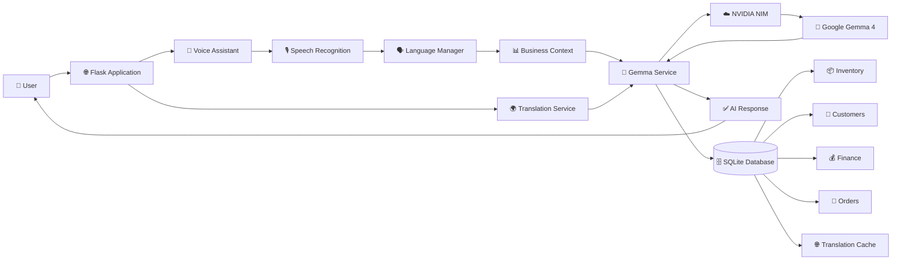

# 🤖 How Gemma AI Powers BizzAssist

## 📌 Overview

BizzAssist uses **Google Gemma 4-31B-Instruct** through **NVIDIA NIM** as its core AI engine. Instead of functioning as a standalone chatbot, Gemma is deeply integrated into the application to provide intelligent business assistance, multilingual communication, and voice-based interaction.

Gemma powers two major features of BizzAssist:

- 🎤 AI Voice Assistant
- 🌍 Multilingual Website Translation

By combining Gemma with Flask, SQLite, and NVIDIA NIM, the application delivers personalized business insights while maintaining fast response times through caching and optimized AI requests.

---

## 🏗️ AI Architecture



---

# 🎤 AI Voice Assistant

The AI Voice Assistant enables users to interact with BizzAssist using natural speech instead of typing.

### 🎙️ Step 1 – Voice Input

The browser records the user's voice and sends the audio to the Flask backend.

---

### 🔊 Step 2 – Speech Recognition

The Speech Recognition Service converts the recorded audio into text.

If speech recognition fails, the application automatically returns a localized fallback response.

---

### 🌐 Step 3 – Language Detection

The Language Manager identifies the user's preferred language stored in the current session.

This ensures that both the interface and AI responses are delivered in the selected language.

---

### 📊 Step 4 – Business Context Generation

Before calling Gemma, the application collects live business information from SQLite, including:

- 📦 Inventory
- 👥 Customer Details
- 📝 Orders
- 💰 Financial Data
- 📈 Marketing Information
- 💬 Previous Conversations

Providing business context allows Gemma to generate personalized recommendations instead of generic responses.

---

### 🤖 Step 5 – AI Processing

The Assistant Service combines:

- User Query
- Preferred Language
- Business Data
- Conversation History

into a structured prompt and sends it to **Google Gemma 4-31B-Instruct** through **NVIDIA NIM**.

Gemma analyzes the complete business context before generating an intelligent response.

---

### 💬 Step 6 – Response Generation

Gemma generates business-specific responses such as:

- 📦 Inventory Recommendations
- 📈 Marketing Suggestions
- 💰 Financial Insights
- 👥 Customer Management Advice
- 🚀 Business Growth Strategies

The response is returned in the user's selected language.

---

### 💾 Step 7 – Conversation Storage

Every interaction is stored in SQLite together with timestamps.

This maintains conversation history for future interactions.

---

# 🌍 Multilingual Translation

BizzAssist supports multiple languages using **Gemma 4**.

Instead of translating every page on every request, the application uses intelligent translation caching.

---

### 🔄 Translation Workflow

```text
English Interface
       │
       ▼
 Translation Service
       │
       ▼
 Google Gemma 4
       │
       ▼
 SQLite Translation Cache
       │
       ▼
 Translated Website
```

Whenever a translation already exists, it is retrieved directly from SQLite instead of calling Gemma again.

This significantly improves page loading speed while reducing AI API usage.

---

## ⚡ Translation Prewarming

Before deployment, BizzAssist automatically translates all interface text into supported languages.

The translated content is stored inside SQLite.

As a result:

- ⚡ Faster page loading
- 💰 Lower API usage
- 🌍 Instant multilingual support

Missing translations are generated in the background without interrupting the user experience.

---

# 💾 Database Integration

SQLite stores:

- 📦 Inventory
- 👥 Customers
- 💰 Financial Records
- 📝 Orders
- 🌐 Translation Cache
- 💬 Assistant Conversations

Gemma retrieves real-time business information before generating responses, ensuring that recommendations are based on current business data.

---

# 🚀 Performance Optimizations

To improve speed and reduce API usage, BizzAssist includes:

- ⚡ Shared Gemma Service Instance
- 🌐 SQLite Translation Cache
- 🔄 Background Translation Prewarming
- 🌍 Session-Based Language Management
- 🗄️ SQLite Write-Ahead Logging (WAL)
- 🚀 Cached HTML Translation

These optimizations minimize latency while maximizing application performance.

---

# 🛡️ Error Handling

The AI system gracefully handles:

- ❌ Invalid API Keys
- 🌐 Network Failures
- ⏱️ API Timeouts
- 🤖 AI Service Unavailability
- 🎙️ Speech Recognition Errors

Instead of displaying technical errors, users receive meaningful localized responses.

---

# ⭐ Why Gemma?

Google Gemma was selected because it provides:

- 🌍 Excellent Multilingual Understanding
- 🧠 Strong Contextual Reasoning
- 📊 Business-Oriented Recommendations
- ⚡ Fast Inference through NVIDIA NIM
- 🔗 Seamless Flask Integration
- 💬 Natural Conversational Responses

---

# 🎯 Conclusion

Gemma serves as the intelligence layer of BizzAssist, powering both the AI Voice Assistant and the multilingual translation system. Voice queries are converted into text, enriched with real-time business information, and processed by Gemma to generate personalized business insights. The translation system uses Gemma to create multilingual interface content, which is cached in SQLite to ensure fast page loading while minimizing API requests.

By integrating **Google Gemma 4**, **NVIDIA NIM**, **Flask**, and **SQLite**, BizzAssist delivers a scalable, intelligent, and multilingual business management platform capable of assisting users through both voice and text interactions.


